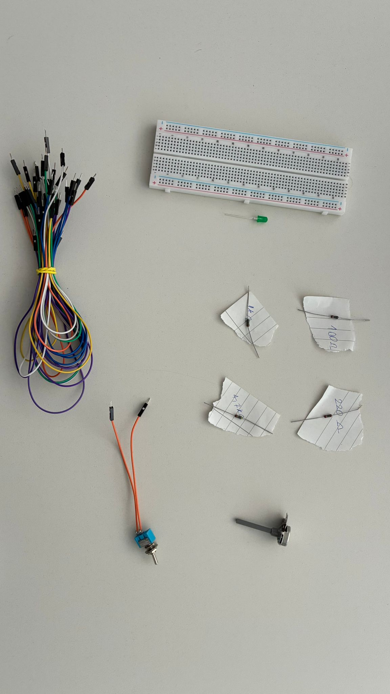
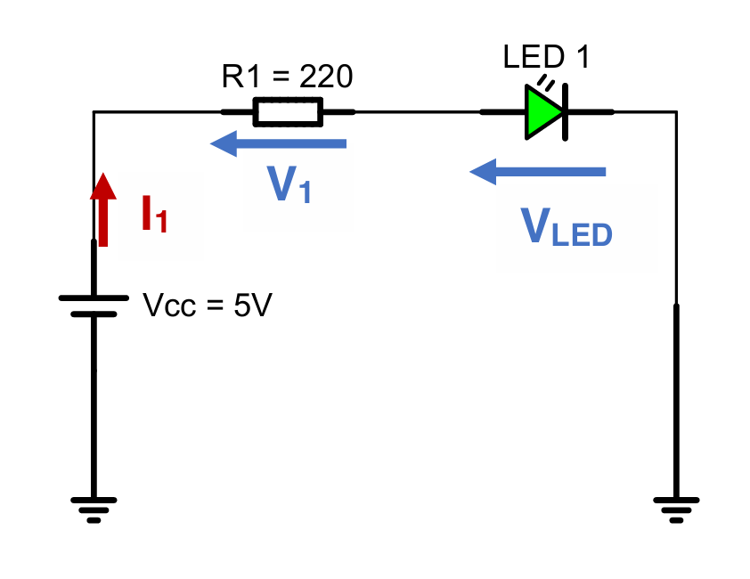
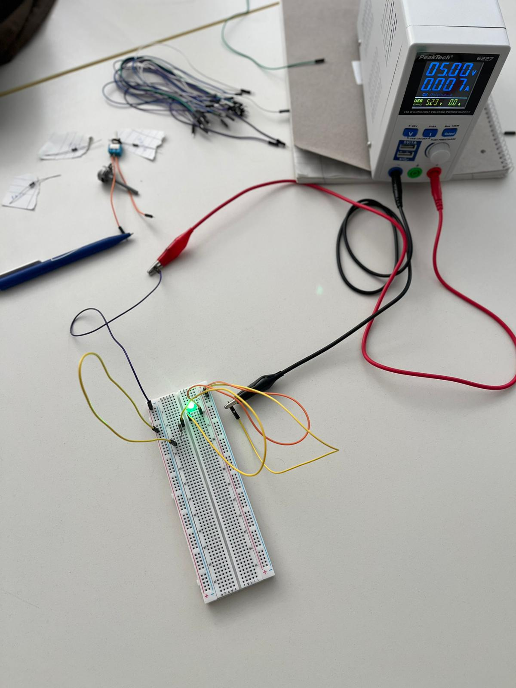

# Exercise 1: Electrical Circuits 

The first exercise took place on the 30th April 2026 and was about Electrical Circuits. I worked on these tasks together with Dena Boveirimonji. All images for this exercise can be found in the folder [ex01_images](../images/ex01_images) as well.

## Task 1 LED Control Circuit
### Task 1.1 Simple LED Circuit
 

Our very frist task was to build a simple circuit according to the schematic above to light up an LED, consisting of the following components:
- Resistors: 220 Ohm, 1000 Ohm, 4700 Ohm
- A green LED
- A breadboard
- Some male-male jumper wires

It did not work immediately. We had to eliminate some errors. For example, at first we put the LED in the wrong direction and mixed-up anode and cathode. After we fixed that, we had difficulties connecting the resistor and LED in series as we were slowly getting used to the breadboard and how its holes are connected to each other. But after some trial and error our circuit worked and ended up looking like this: 

As a follow-up, we were tasked to measure the voltage for multiple resistors with different Ohm values (220, 1000, 4700) and the voltage of the LED. To measure the voltage, we used a multimeter and placed the rods on each "leg" of the resistor / LED, so we were connected in parallel to the resistor / LED (see photo below). At the beginning, we had some difficulties measuring a plausible voltage value. For example, at times we measured near 0 V because we had placed the rods of the multimeter slightly off-place or did not have stable contact with the anode and cathode of the LED. 

(pic4)

In the end, the voltages we had measured were:

| R1 [Ohm] | Measured V1 [V] | Measured VLED [V] |
| :-----------------: | :------------------------: | :--------------------------: |
| 220 | 2.1 | 2.7  |
| 1000    | 2.5   | 2.4 |
| 4700    | 2.6  | 2.4 |

We observed that the voltage at the resistor V1 was increasing the higher the Ohm was. On the other hand, the VLED was decreasing with higher Ohm. Additionally we observed that the higher the resistance R1 was the dimmer the LED became. At all times both V1 and VLED were roughly adding up to 5V because R1 and the LED were connected in series and therefore the voltage was split between each other.

### Task 1.2 Switchable LED Circuit

For task 1.2, we had to build a 2-position switch into our circuit according to this schematic: 

(pic5) 

At first, we simply added the switch to our existing circuit, but when we tried to operate the switch, the LED did not change at all. We then realized that we accidentally added the switch in parallel to the circuit. Since the electricity is choosing the path with the least resistance, it did not go through the switch but our existing path, so the switch did not control the flow. We removed one orange cable to remove the parallel connection and then it was possible to turn the LED on and off via the switch (see images below). 

(pic6) (pic7) 

We also tried connecting the switch in the opposite direction by rotating the switch by 180 degrees. It did not change its function. The LED could still be controlled by the switch, which means that the switch, unlike the LED, has no polarity and works the same regardless of orientation. 

### Task 1.3 Dimmable LED Circuit

(pic8) 

For this task, we had to add a potentiometer to our circuit according to the schematic above. We eventually realized that the middle pin of the potentiometer should lead to the LED as it is the variable output. Meanwhile, the outer two pins go into GND and VCC respectively. After some trial and error, we successfully integrated it into our circuit (see image and video below). 

(pic9) (vid1) 

We could immediately observe the behavior of the LED. When turning the potentiometer fully on (turning it multiple times clockwise), the brightness of the light increases. Turning it anticlockwise decreases the brightness of the LED. 

Then we used the multimeter to measure the voltages at the LED and the potentiometer at different positions. The values are in the table below: 

| Position               | VLED [V] | V2 |
| :-----------------: | :------------------------: | :-----------------: |
| a) full brightness | 2.4 | 3.0 |
| b) dimmed          | 2.2 | 2.1 |
| c) OFF                 | 0.04 | 0.08 |

We observed that the voltage at the LED and potentiometer were the highest at full brightness. When we brought the LED into the dimmed position, the voltages decreased slightly for both the LED and potentiometer. When we turned the potentiometer fully to the left side (OFF) the voltages were near 0. We noticed that the LED would already go completely dark at around 1.8 V. So less than 1.8 V is not enough for the LED to shine. 

So overall, we witnessed the ability of the potentiometer as a semiconductor. We could operate it to change its resistance which in turn affects the voltage leading to dimming / brightening the LED. 

## Task 2 Transistor Switch Circuit
### Task 2.1. Switchable LED Strip
### Task 2.2 Dimmable LED Strip

