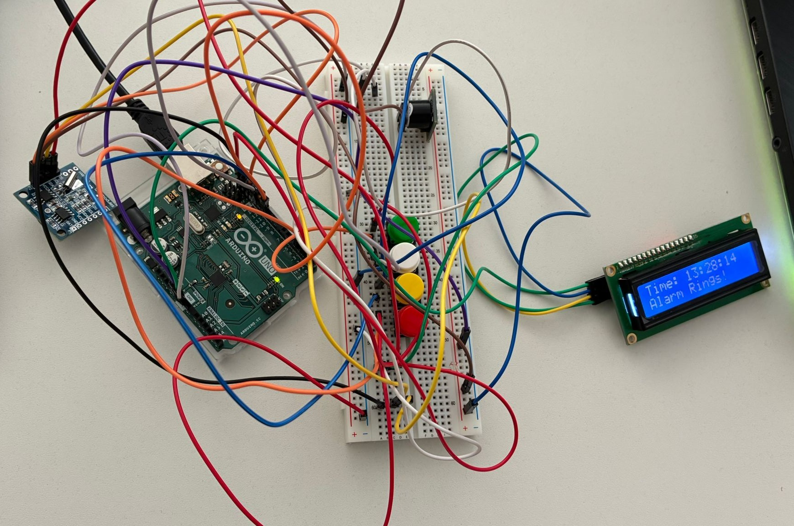
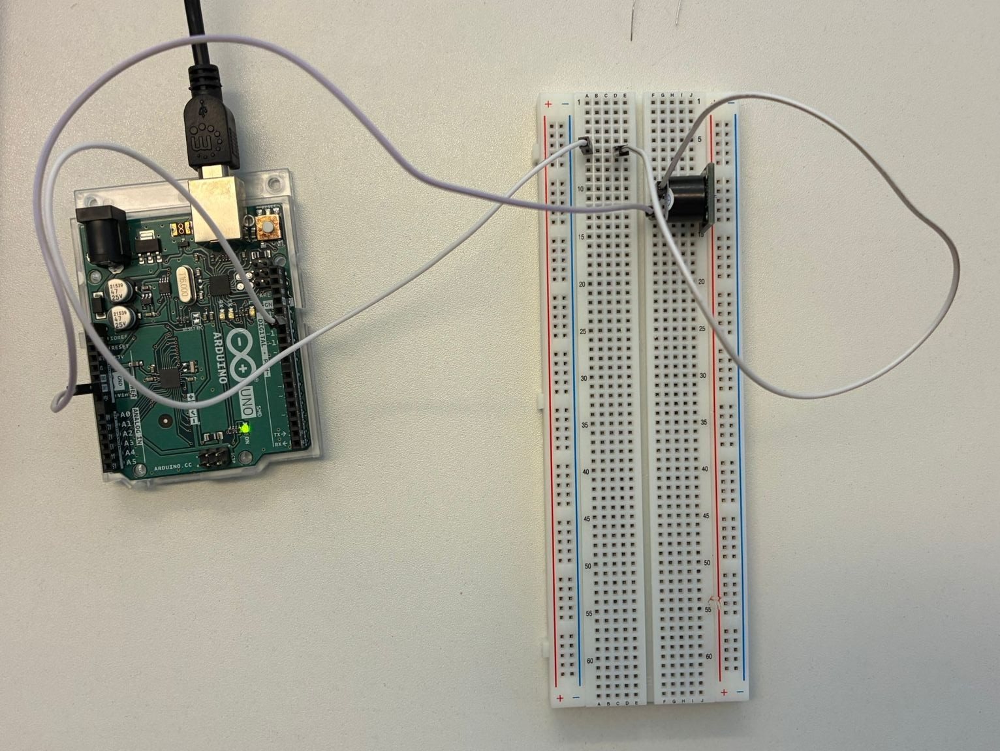
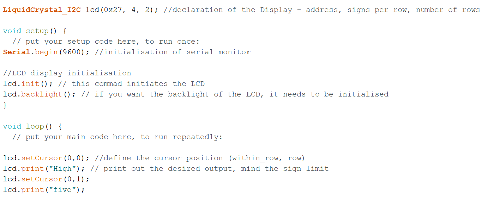
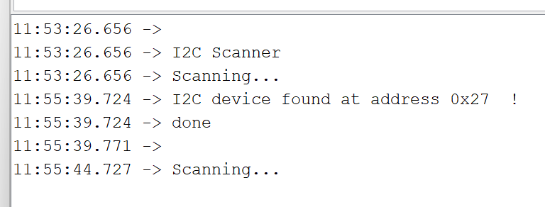
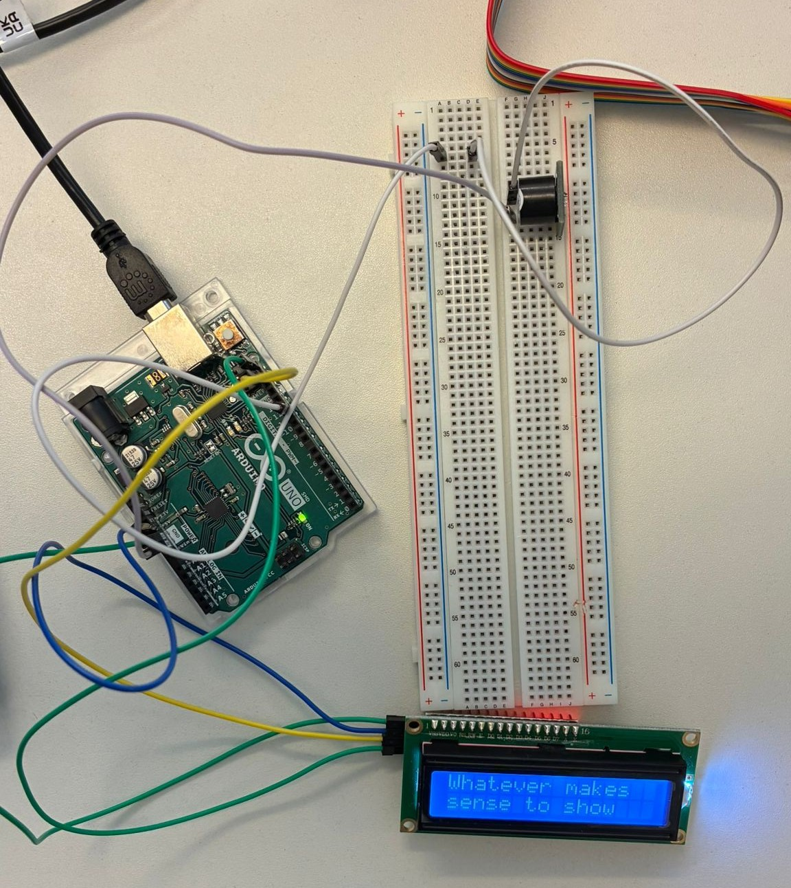
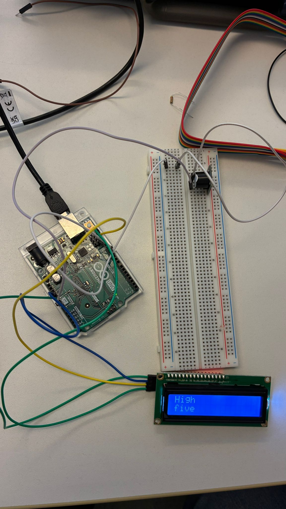
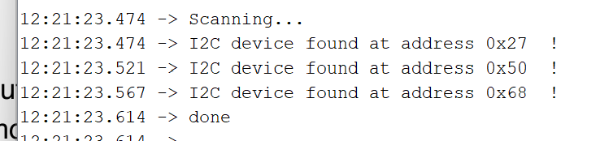
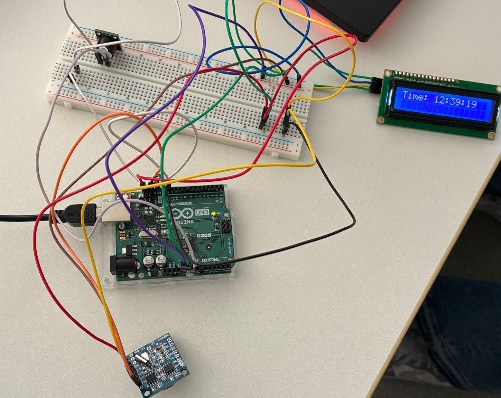
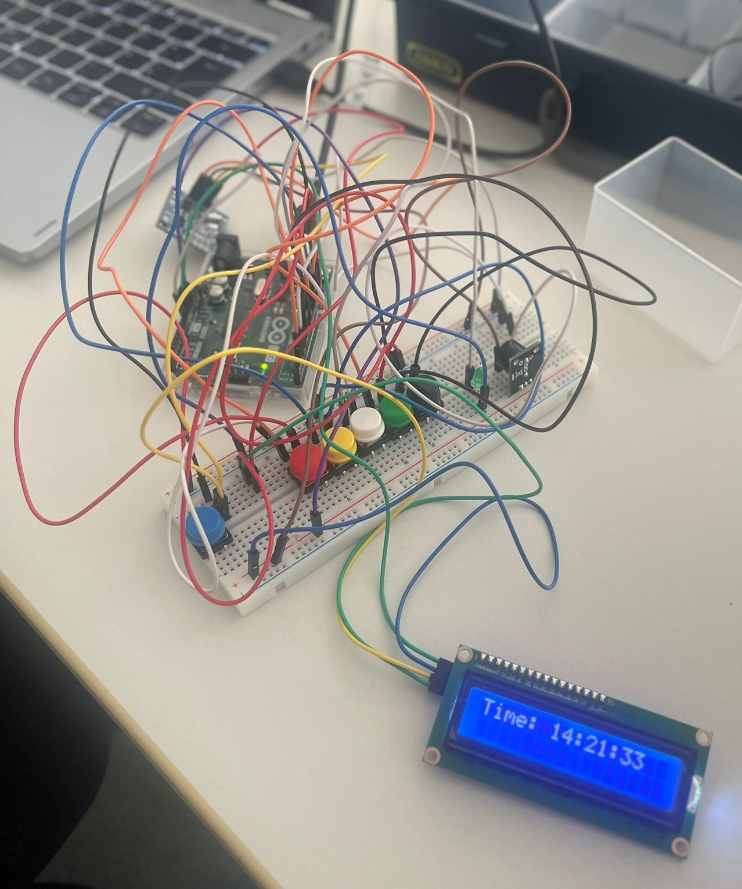
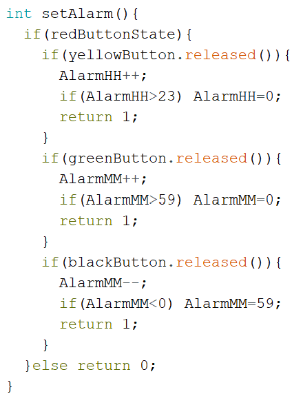

# Exercise 2: Introduction to Arduino

The second exercise took place on the 7th May 2026 and introduced us to the basics of Arduino. The goal was to gradually build a working alarm clock (see image below) by adding several sub-circuits with different features. By the end, we could further customize it by adding more features to it. For this exercise I was working together with Dena Boveirimonji. The images for this exercise can be found in the folder [ex02_images](../images/ex02_images), while the videos are uploaded in the [video](../videos) folder.  

## Preparation for building a basic alarm clock
### Sub-circuit 1 - Connecting the buzzer

For the first sub-circuit, we were adding buzzer and resistor to the circuit. At first it didn't work. After removing the resistor and defining the right pin in the code it worked (see image below). Our mistake was that we connected the cable to pin 12 but in the code we forgot to change the pin for the buzzer, as it was set to 4 originally. 

Afterwards, we tested some different settings for the duration of delays and sequences of HIGH/LOW signals to create different buzzer-patterns. We figured out, that the constant “howManyRings” controls how often the buzzer rings during one launch because it is used as a counter in a for-loop. Meanwhile, a combination of the methods “digitalWrite(buzzerPin, HIGH)” and "delay(2000)” determines how long one ringing lasts. 2000 in this case describes a ringing lasting 2000 milliseconds (meaning 2 seconds). On the other hand, a combination of “digitalWrite(buzzerPin, LOW)” and a delay-command declares how long a break between the ringing should last. Within the same for-loop multiple combinations of digitalWrite- and delay-commands with varying lengths of delays can be used to create a sequence for the ringing which will be repeated depending on the number set in “howManyRings”. Examples of our testings with different settings are shown in the following video: 

(video1) 

The video shows the original buzzing settings & second setting where howManyRings = 3, ringing lasts 2 seconds with 1 second breaks in between each iteration.

### Sub-circuit 2 - Connecting the LCD screen

For the second sub-circuit, a LCD screen was added. We followed the instructions of the task descriptions closely, connected the SCL and SDA wires. Then we ran the I2C_scanner.ino sketch from the zip file to find the address of the LCD screen. The device was found at the address 0x27 and was added to the declaration of the LCD (see images below). 

 

After it was declared we uploaded the sketch and the screen was connected successfully as it showed the text “Whatever makes sense to show” from the code (see image below). 

We then played around with some settings to figure out how the screen works. We noticed that the screen can only display 16 signs per row at maximum and only 2 rows in total, which can be set in the declaration of the LCD screen as parameters (LiquidCrystal_I2C lcd(0x27, 16, 2)). Increasing the signs per row or row numbers past the limit does nothing. We also learned that the lcd.setCursor() method is used to choose which row the cursor is pointing at to let it print a text in the next method. (0, 0) is the first row and the second row is at position (0, 1). Playing around with these settings, we could for example set the number of signs to 4 and let the screen display the text “High five” (see image below). 

 

### Sub-circuit 3 - Expanding the setup with a Real Time Clock

At first we connected the Real Time Clock (RTC) incorrectly to the circuit because no other address was shown when the scanner ran. Our mistake was connecting the SDA and SCL wires of the RTC to the board while the SDA and SCL wires of the LCD screen were connected to the other free respective pins on the board. Therefore, the circuits were in parallel. 

After we connected the SDA and SCL wires so that they were in series, 3 addresses showed up in the scanner (see images below). We were unsure whether it was intended that way but believed that the RTC had two addresses. We picked one of the extra addresses and continued with the code. 

After we set the current time with the rtc.adjust() method and DataTime-declaration the real time was set and displayed on the LCD screen as shown below. 

### Sub-circuit 4 - Using the Push Button

As a final step to finish a base for the alarm clock we added 4 buttons to the circuit and ran the test code from the zip-file (see image below). 

Each button has each own functionality upon pressing the button: 
- White: activates or deactivates the alarm 
- Red: enters or exits “set alarm” mode 
- Yellow: when in “set alarm” mode increases hour 
- Green: when in “set alarm” mode increases minute 

## Customized alarm clock

Dena and I added some more functionalities to the alarm clock such as a snooze button, decreasing minute button, LED blinking and buzzer melody. The full code for our custom alarm clock can be viewed in LINK. 

### Decrease minute button

First we added a black button connected to pin 7 which can be used to decrease the minute during “set alarm” mode because it was annoying to press another 59 times just to decrease the minute by one. Then we declared the right pins in the code and added another if-statement in the set-alarm-mode: 

### LED synchronized blinking to buzzer

Next we added an LED to the circuit and made it blink synchronically to the buzzing pattern so we have a noticeable visual indicator for the alarm as well. We connected the LED to pin 10. In the code , whenever a digitalWrite(buzzerPin, HIGH) was set we simply added a digitalWrite(ledPin, HIGH) right below it. The same goes for the LOW command to turn it off. 

### Snooze button

We added a blue button and connected it to pin 9 which acts as a snooze button to stop the ringing for 10 seconds. When snooze is active a countdown is displayed on the LCD screen as well to see the remaining time until the alarm starts again (see video for demonstration). 

(video2)

### Melody on buzzer
