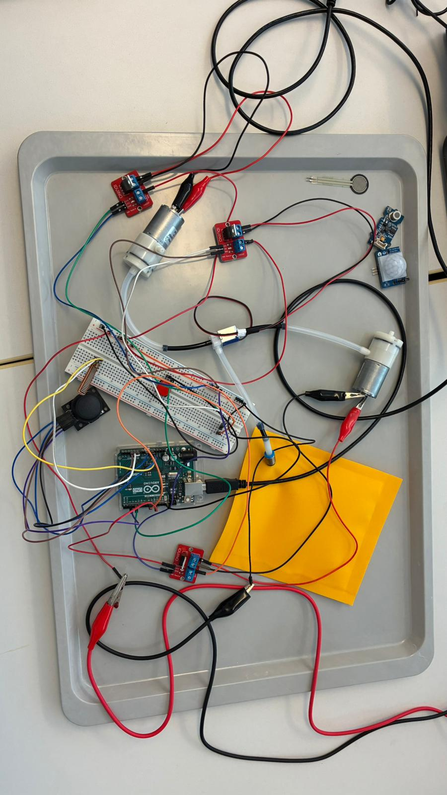
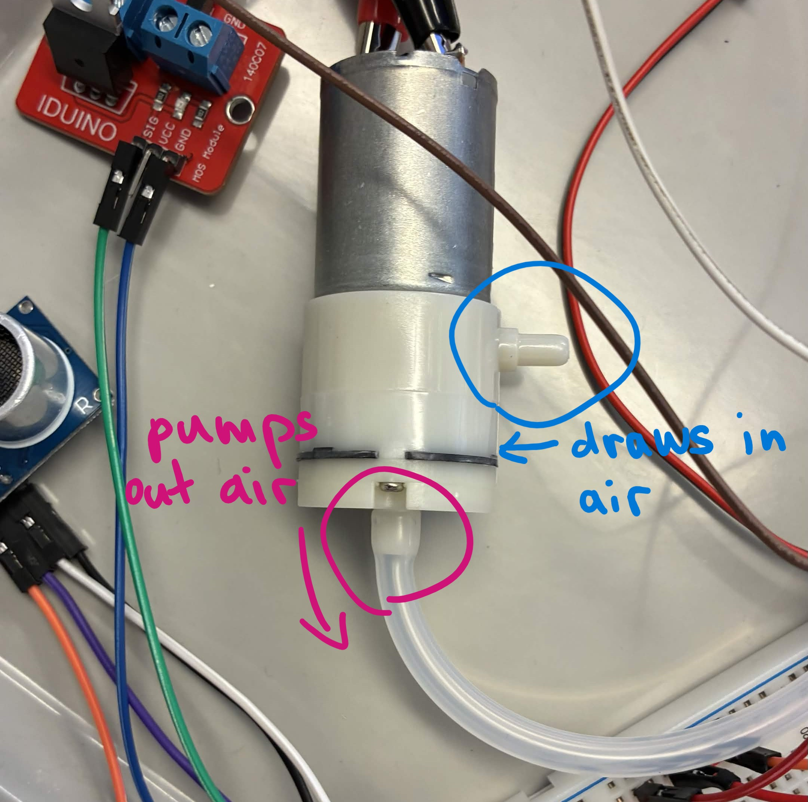
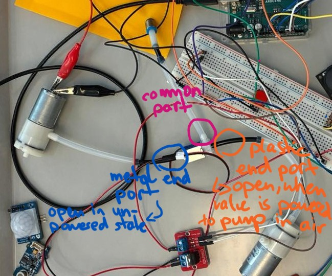
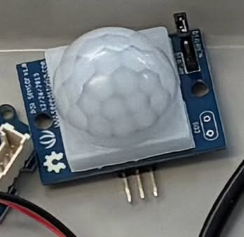
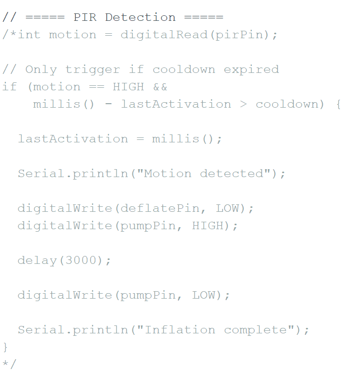
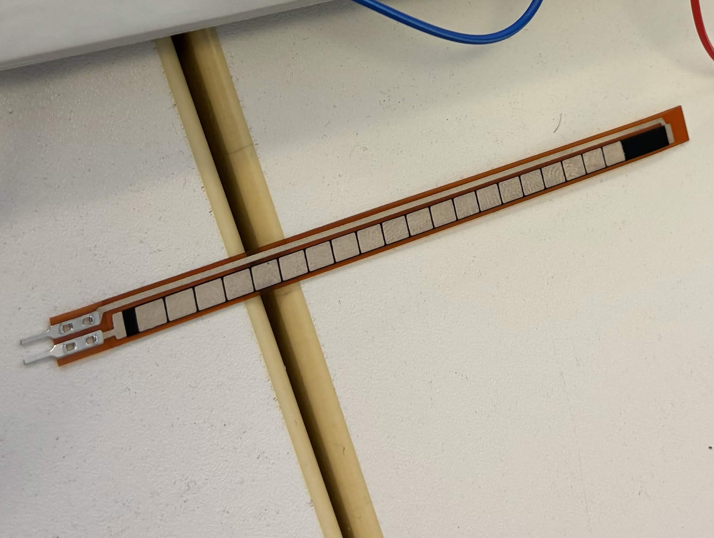
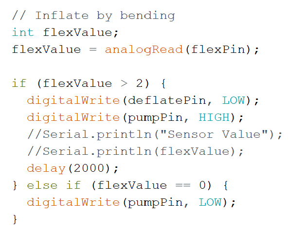
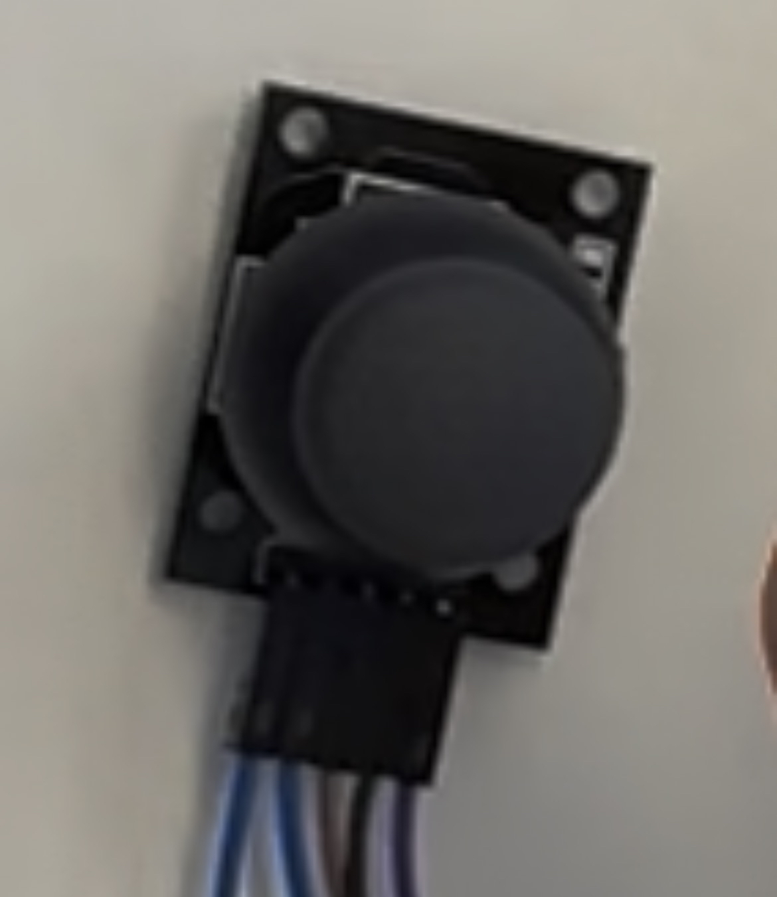
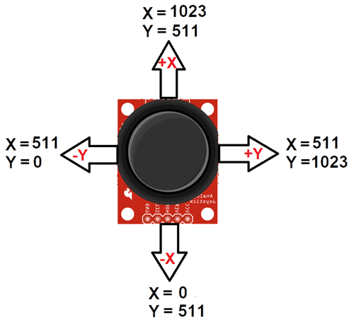

# Exercise 3 - Sensors and actuators

The third exercise took place on the 21th May 2026 and was about integrating sensors and actors into an electrical circuit to deflate / inflate an inflatable pillow (see image below). For this exercise I was working together with Dena Boveirimonji. The images for this exercise can be found in the folder [ex03_images](../images/ex03_images), while the videos are uploaded in the [video](../videos) folder. The code for our system can be found [here](../files/Pumping_version1.ino).

The base of the system consists of:
- Air valve
- 2 air pumps
- Inflatable pillow
	

[Video of system in action](../videos/ex03_joystick_deflation_flexSensor_inflation.mp4)

## Part A - Pneumatic and electrical circuit

1. Our strategy was to replicate the circuit of Juliusz including the ultrasonic distance sensor and a button to have a functioning circuit which we can adjust afterwards.
2. After replicating the wiring we tested whether everything was connected correctly by uploading a testing sktech that makes the 3 MOSFETs blink, which was successfull.
3. We checked wether the MOSFETs, the air pumps and the microcontroller were connected to the right circuit so we do not apply too much power to the microcontroller by accident then we uploaded a sketch which was supposed to alternate between inflation and deflation automatically, however it did not work at first.
When we checked the datasheet which was included in our exercise description we noticed that we connected both of the air pumps as deflaters by accident, because the tube was connected to its side. That way both air pumps drew out the air from the air bag. So we turned one of the air pumps to a pumper by putting the tube to ist bottom valve (see image below).

5. Then we wrote a sketch with a button to control the deflation. In theory it should automatically start pumping and when the button was pressed continuosly it would deflate. However it did not work at first, it would only inflate. Pressing the button activated the deflation-pumper but the air was actually not drawn out. After we consulted the datasheet again, we realized that we had to switch the connection on the air valve around because different parts are open depending on if the valve is in a powered/unpowered state. We decided to connect the deflation-pump to the metal-end port of the valve so that path is open in an unpowered state. The inflation-pump is now connected to the plastic-end port. Additionally the air valve is indirectly connected via the MOSFET to the same pin which also controls the inflation-pump (pin 8). By doing so the air valve can be set into the powered state too and opens its path for pumping air into the air bag (see image below).

After applying this change and adding some delays in the code so the deflation lasts longer, the system finally worked as intended.

## Part B - Sensor Interaction

In this part we tried 3 different sensors as input methods to control the inflation and deflation.

### PIR Sensor

Our first sensor was a PIR motion sensor (see image above). At the beginning we misunderstood its functionality. We thought that it would react to the presence of a person. Which means a person has to be in front of the sensor for some time for it to activate. So we wanted the system to start inflating the air bag if a hand is held above the sensor and stop inflating if there is none. We added some debugging-messages that print the state of the pumping into our console to understand the code logic better but the results were confusing. Even if we did not place our hand before the sensor, it would start pumping seemingly randomly (as seen in this [video](../videos/ex03_confusing_behavior_PIR_sensor.mp4)).

In order to understand the behaviour of the PIR sensor better we looked up Youtube tutorials of projects using a PIR sensor and how it behaves in action. Then we understood that the PIR sensor was just very sensitive to any kind of movement. We came to the conclusion that our minor arm movements and shadows were already enough to trigger the movement detection on the PIR sensor and activate the pumping.
Our solution to this behaviour was to add a cooldown for the activation and a delay of 3 seconds so the pumping lasts 3 seconds. That way, the pumping could only be activated every 7 seconds and does not trigger repeatedly on any tiny movement within that time.

The PIR sensor was working, however we felt that the interaction was not that intuitive and smooth as expected. For example when the cooldown and pumping-delay did not align, it would not start pumping again even though we were waving our hand in front of the PIR sensor for a few seconds. We left the code for the PIR sensor within the Arduino-file but it is commented out. Next, we tried to use a flex sensor for activating the pumping. 

### Flex sensor

We connected the flex sensor (see image above) to our system and wanted to test it by printing its values in the console. While we were bending the flex sensor we noticed that no matter how hard we bended it the values never changed and remained at 0. At first we thought the wiring or code was wrong and checked them repeatedly but there was no change in values. Then we replaced the flex sensor with another flex sensor and finally the values changed when we were bending it. So it turns out the first flex sensor was just broken.

Next we wanted to use the values as conditions to trigger the inflation. We noticed that even when the flex sensor is unbended the value remains at 1. So just to be on the safe side we set the condition that values greater than 2 would trigger the inflation (see image of code below).

Overall the system worked, as demonstrated in this [video](../videos/ex03_flexSensor_inflation_button_deflation.mp4)

### Joystick

Lastly, we wanted to use a joystick to trigger deflation. Originally we wanted to move the joystick to the right to trigger deflation but when we printed the coordinated to the console, we noticed that moving the joystick to the right did not change the values at all. We checked the orientation of the joystick and compared our values with the range of possible values with an online datasheet (see image below).

(Image source: https://components101.com/modules/joystick-module)

When the joystick is not moved the X value remains at 505 while the Y value jumps between 454 and 455. There is only one case in which the values change which is when we move the joystick up. Then the X value becomes 1023 and the Y value jumps within the range of 875 and 877. Moving the joystick in any other direction is not registered for some reason and does not show any changes in values. This suggests that the joystick might not be fully functional as the values differ a bit from the datasheet and do not change at all for some movement directions.

We simply decided to use the coordinates for moving up instead and pairing these values with triggering the deflation on the pumps.
So in the end our full system looked like this:

The deflation and inflation can also be seen in this [video](../videos/ex03_joystick_deflation_flexSensor_inflation.mp4)

# Some takeaways from this exercise

- Checking Youtube-tutorials that showcase the functionality of a sensor with the code is useful for understanding the behavior in action.
- Checking the datasheet is also useful to understand technical details such as operating voltages, what port does what etc.
- ChatGPT might not understand which sensors we are actually using and how our circuits are connected so its instructions and solutions need to be taken with a grain of salt. It can be helpful in debugging the code and logic though.
- Printing the values of a sensor into the console is useful to see the state of the sensor and which values we could use as conditions.
- Sometimes the problem is not the wiring or code but the hardware itself. Swapping a sensor with another sensor of the same type can be worth it to see if the first sensor just happened to be broken. This can be done to avoid wasting time fixing wiring/code that was not wrong in the first place…
