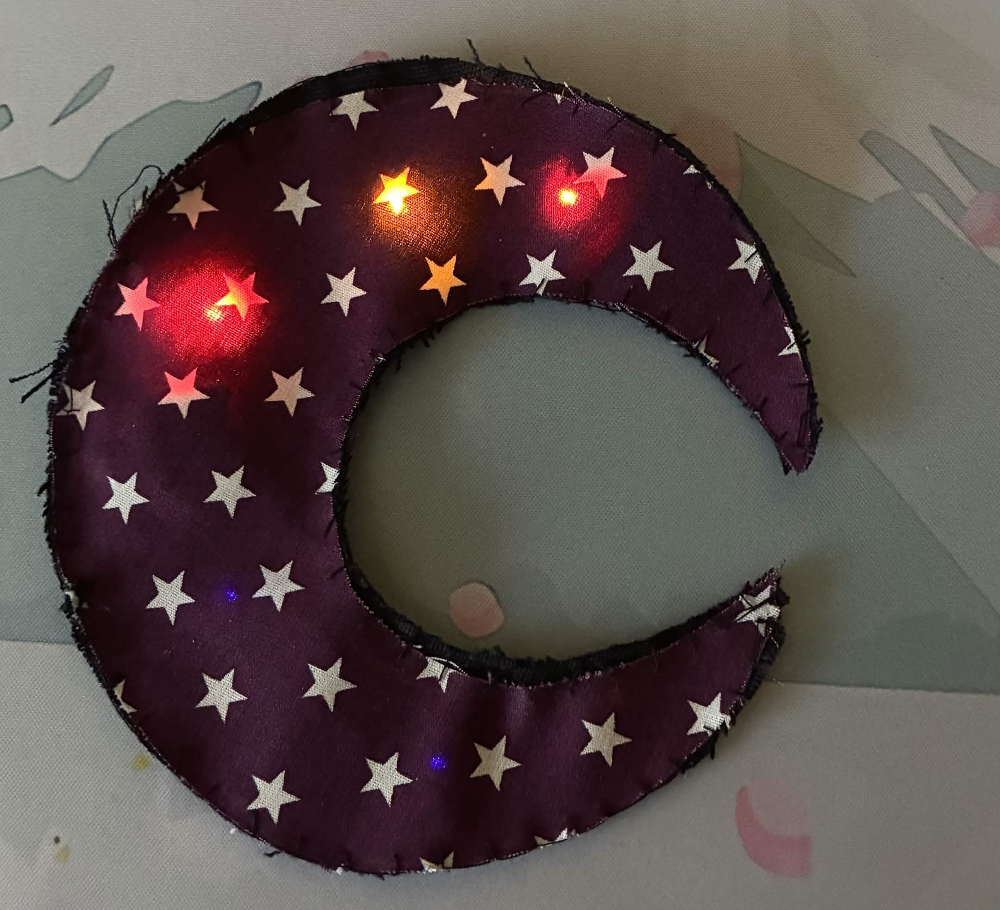
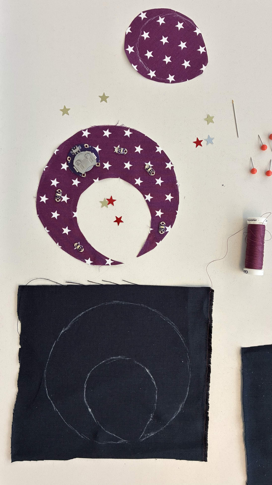
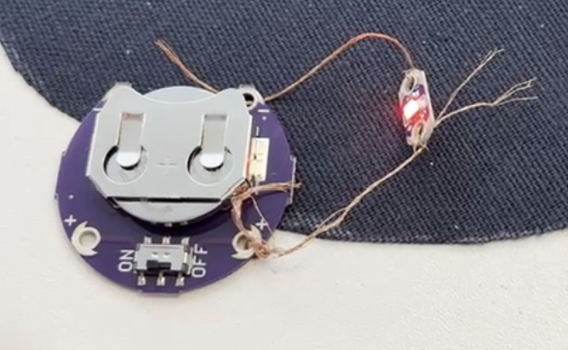
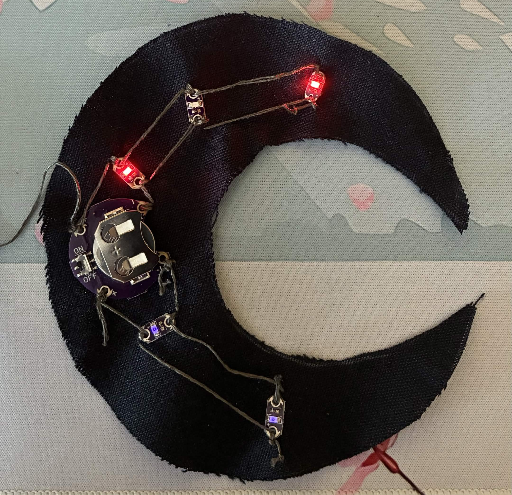
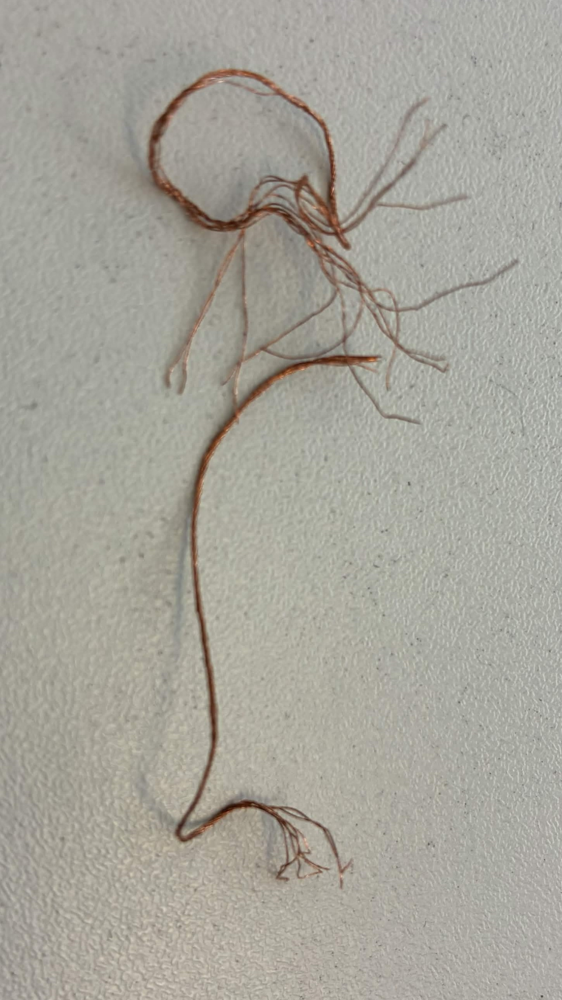
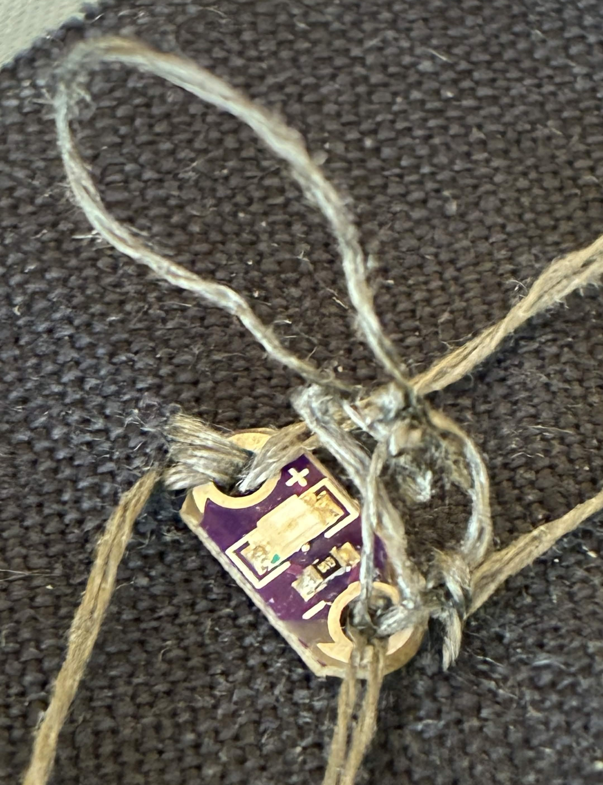
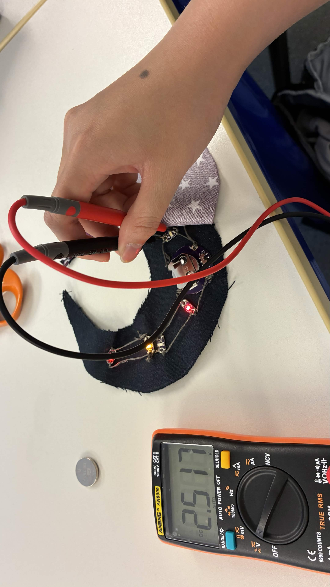
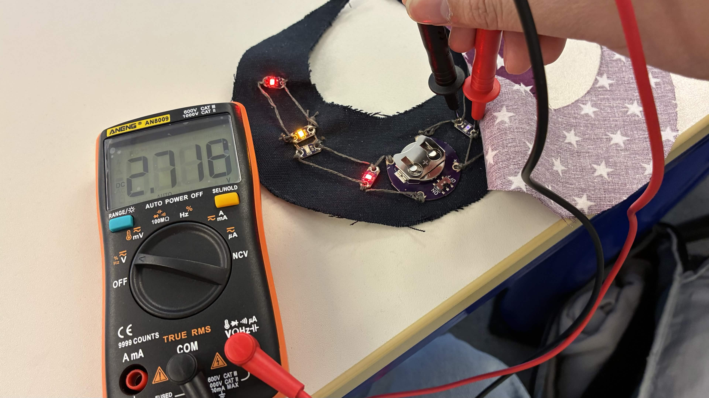
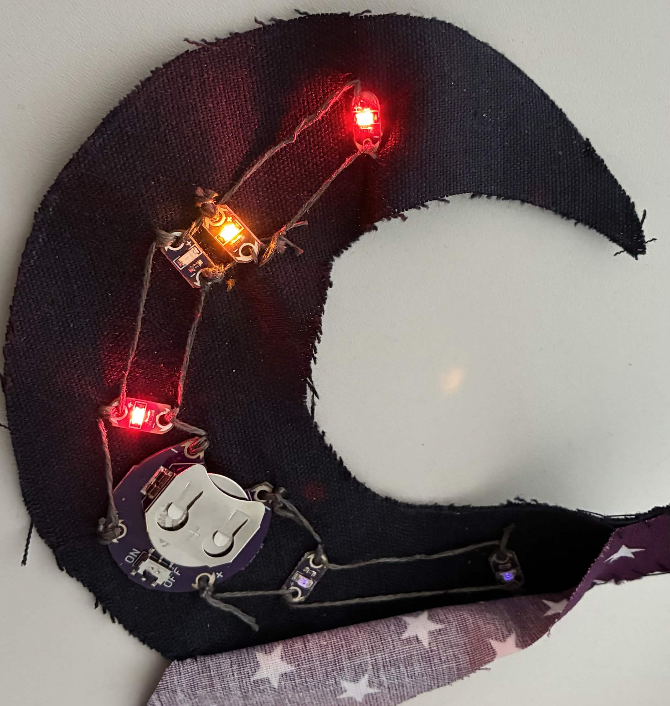

# Exercise 4 - Interactive Patch Design

The fourth exercise took place on the 28th May 2026 and was about E-Textiles. The images for this exercise are in the folder [ex04_images](../images/ex04_images). Videos can be found in the [video](../videos) folder as well.

Our task was to create a textile artifact with 5 LEDs that are connected via conductive yarn (see image above).
The first step was to choose two different fabrics and decide on a shape for the artifact. I settled for a black and purple fabric with a star pattern. As for the overall shape, I wanted a half-moon that fits the night-sky theme (see image below). I took 5 LEDs, which were red and purple.

Before I started sewing the LEDs on the fabric, I wanted to test the different conductive threads first to decide which one I would continue to use for all connections between the LEDs. The first thread I tried out was metal-wrapped nylon thread. I loosely tied the thread to the LED's poles and connected them to the battery to check whether the LED lit up (see image below).

After making sure that the yarn could form a functional circuit, I started sewing the LEDs on the fabric and connecting the LEDs in parallel (see image below).

## Challenges

During the process, there were some challenges. Some conductive threads were difficult to sew with. The metal-wrapped nylon thread was a bit too stiff to my liking and also unraveled itself at the tips, so it was difficult to get them into the needle hole (see image below).

As a result, I switched to a metal-filled craft thread, which was softer and much easier to sew with. Sewing itself was also a difficult task, but it was mainly a personal skill issue. Sometimes the yarn would get tangled, which was frustrating to deal with as an amateur seamstress (see image below).

The purple LEDs I connected to the battery first lit up at the beginning, but a few days later, when I added the other LEDs, the purple LEDs did not light up anymore. I used a multimeter to check the continuity, which was fine (see this [video](../videos/ex04_checking_continuity.mov)). Checking the voltage at the LED with a multimeter showed 2.5 volts. Juliusz suggested using a fully charged battery instead. After replacing the battery with a fully charged one, the purple LEDs lit up again. Checking the Voltage now showed 2.7 volts. The purple LED did not light up at 2.5 volts but it did at 2.7 volts.

 

It was then that I understood that purple LEDs require a higher voltage to light up than red LEDs. However, there was still one LED that did not light up at all. Both continuity and voltage checks were fine, so I concluded that the LED itself was broken. I made a mental note to test each LED by connecting it loosely to the circuit before sewing it into place. Since the broken LED was a fixed part of the circuit already, and removing it without cutting up everything was a hassle I simply added another yellow LED to the circuit to have 5 functional LEDs (see image below).

After checking that each LED lit up, I sewed both half-moon shapes together so the artifact becomes more stable. And thus, my E-textile artifact was done (see image below).

