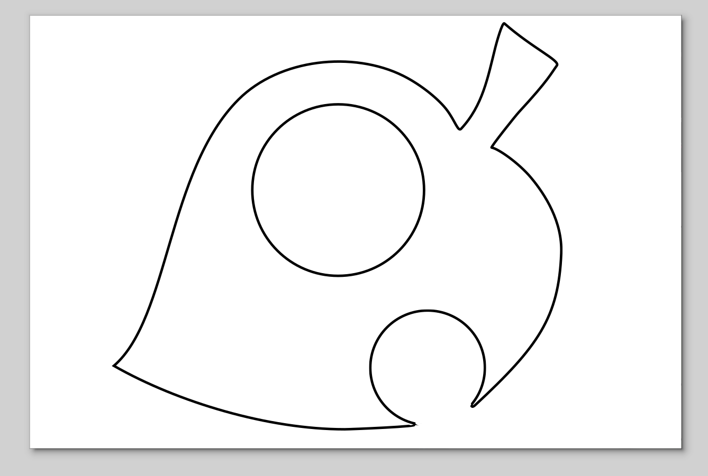
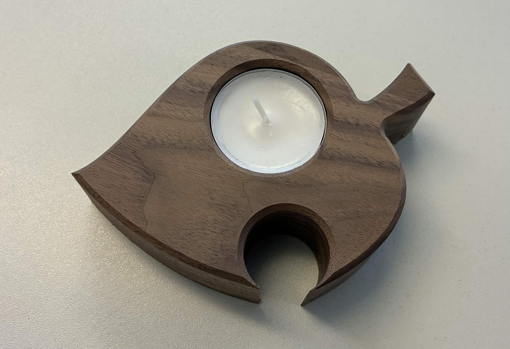
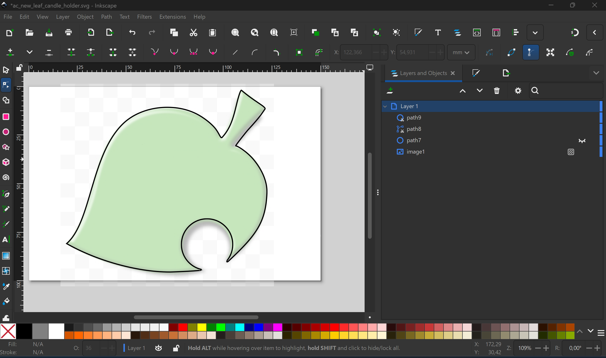
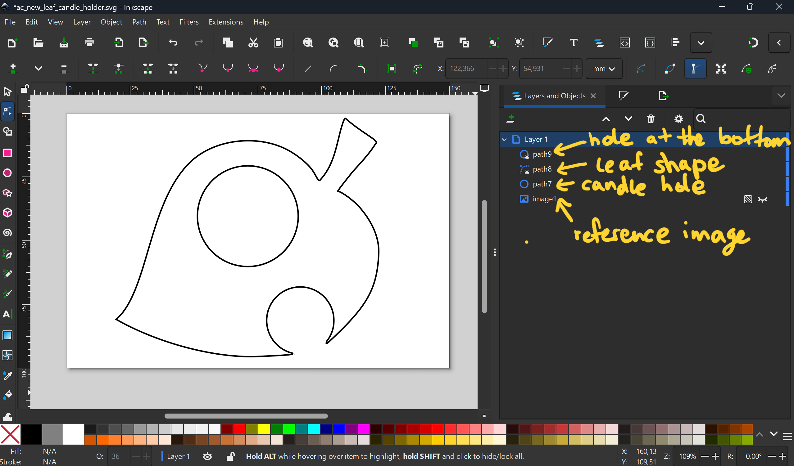
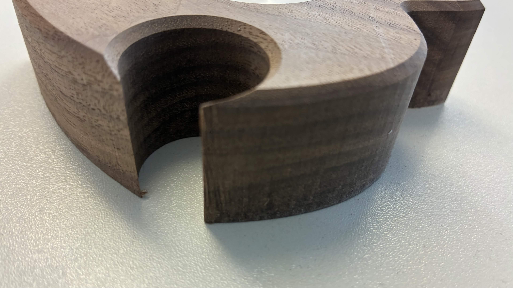

# Exercise 5 - Designing for CNC milling

The fifth exercise took place on the 3rd June 2026 and was about CNC milling. The images for this exercise are in the folder [ex05_images](../images/ex05_images). The svg-file of the finished design can be found in the [file](../files/MaiLinh_Nguyen_darkwood.svg)-folder. The task was to create a design for a candle holder in Inkscape which will be milled out of a wooden block.

 

I decided I wanted the shape to be the Animal Crossing: New Leaf logo because it is one of my favourite games and I think the shape is unique (see image below). My strategy was to get an image from the internet and trace over the lines.

Source: https://www.clipartmax.com/middle/m2i8Z5N4d3G6N4i8_leaf-clipart-transparent-background-animal-crossing-new-leaf-logo/

I set the above image to the lowest layer and decreased the opacity so I did not get confused while drawing the vector lines on top of it. Then I drew the paths for the leaf on the upper layers. Luckily, my laptop is a convertible, so I was able to draw the lines with a pen directly on my screen, which sped up the process and made it easier for me to place the lines accurately. I used the pen tool with a high smoothing setting to draw smooth lines and balance out my shaky hand-drawn lines. Then I edited the nodes in the graphs and removed some to achieve even smoother lines, and eliminated the shaky parts.

There is a "hole" in the leaf at the bottom. My first attempt at drawing that part was a bit shaky, so I used the circle tool instead. Then I only needed to adjust the position of the circle and erase the bottom part of it, and the hole of the leaf was done (see image below).

Lastly, the candle hole was added and placed farther toward the middle of the leaf so the edge is not too thin. Overall my layers consists of the general leaf shape, the candle hole, the hole of the leaf at the bottom and the reference layer at the bottom (see image below).

## Milling

Before the milling I chose a darkwood type for my piece because I thought the example pieces presented in the class made out of darkwood looked precious. In the end my milled design looked like this:

I was warned that some parts of my design was narrow and might be fragile once it was milled. Some minor force or dropping the object might break some parts off. Sure enough, the parts did end up very pointy and thin (see image below).

So in the future when designing these parts I might add more width and round them up so these parts become more stable to avoid it breaking off.
