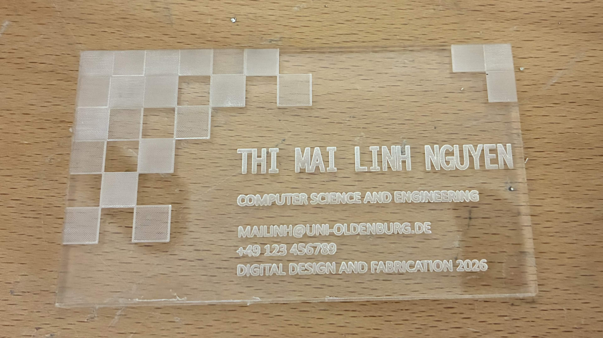
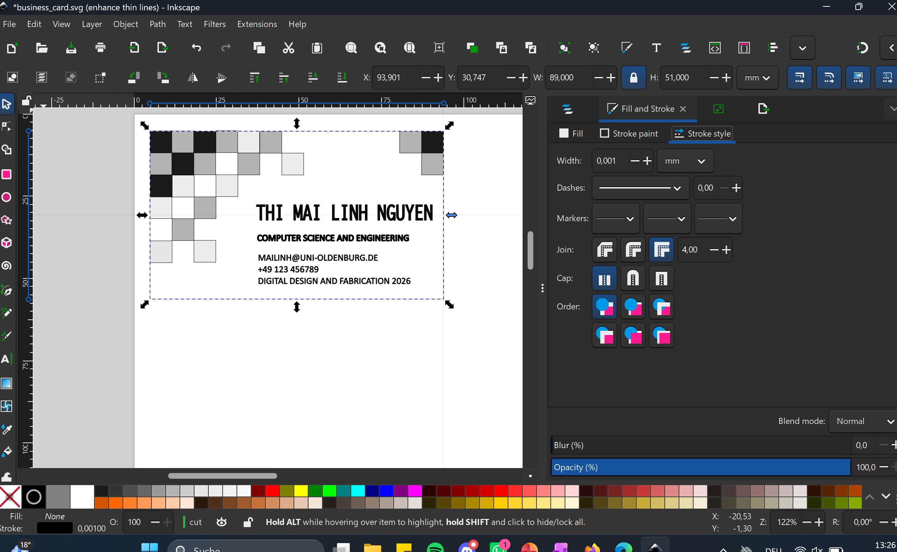
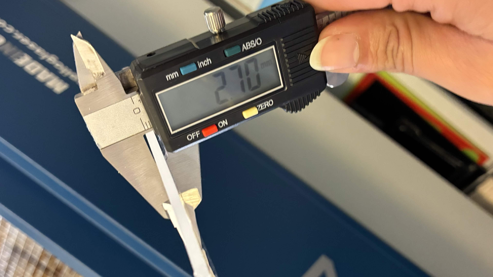
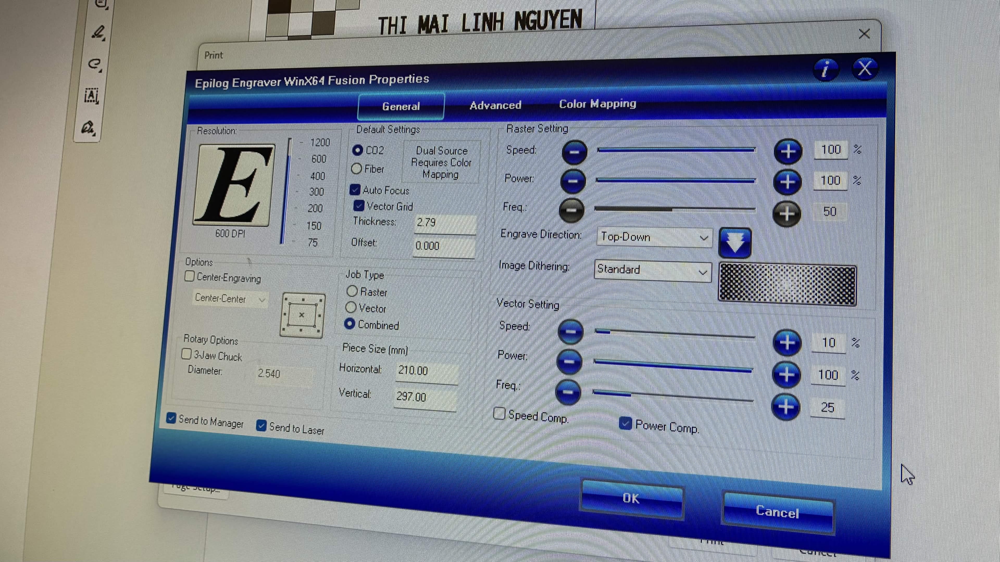
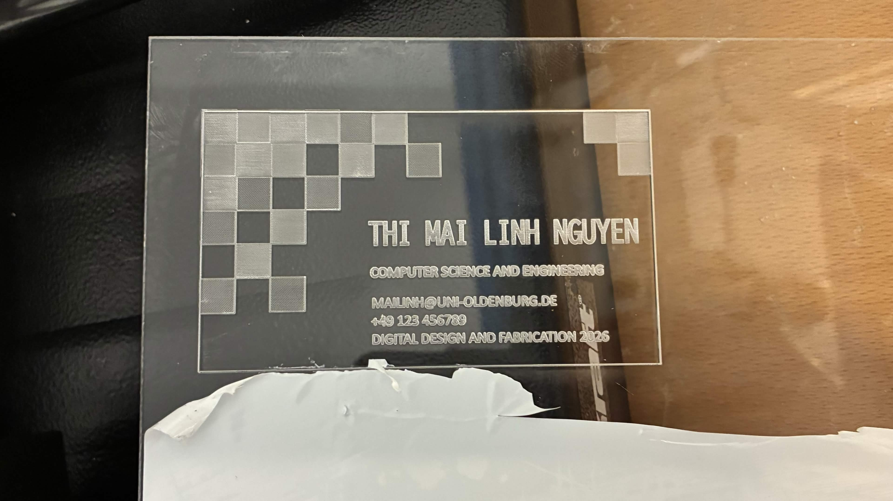

# Exercise 6 - Laser-cut Business Card

The fifth exercise took place on the 11th June 2026 and was about laser cutting. The images for this exercise are in the folder [ex06_images](../images/ex06_images) and the svg-file of the design can be found in [files](../files/business_card.svg)-folder. The goal of this exercise was to get familiar with the process of laser cutting and how to create a business card design that will be laser-cut.

## Designing

For the design of the business card, we had to decide on a material that would be cut. Together with Dena, we were discussing which material to use. At first, I wanted to use plywood because I saw many great laser-cut projects with it in the slides, and I liked the burnt-edges aesthetic. It was also mentioned that it was the most commonly used and easiest to deal with. However, when I looked up some laser-cut business card designs online, I stumbled upon acrylic glass ones, and I immediately liked the frosted engravings. So in the end, we both decided to use acrylic glass.

For the actual design of the card, I wanted to have some kind of pixel-pattern to go with the computer-science theme of the card. So I added some tiny squares in the top-left corner of the design and displayed them like a chessboard pattern. Then I wondered if it was possible to have different degrees of “frosting” for the pixels. In order to achieve that, I had to manipulate the squares in greyscale and vary the brightness of each square.

As for the text, I only wanted to display my name and some fake contact information. Lastly, I checked the stroke widths. I made sure that the outer rectangle had a width of 0.001mm, so the laser cutter recognizes it as a part to be cut through completely. Meanwhile, all the other design elements had to have fills or a width of at least 0.2mm to be recognized as engravings. So my design ended up looking like this:

## Cutting

I exported my design as a pdf-file and uploaded it to the laser cutter. Then I was guided through the settings and how to operate the laser cutter. I peeled off the protective foil from the acrylic glass sheet and measured its thickness (see image below).

After putting it in the laser cutter and setting the thickness to 2.7, I set the speed and power of the raster and vector. For the values, I consulted a table that had recommended values for the speed and power according to each material. Therefore, I set my speed for the vector to 10%. Since my design had both vector and raster elements, I chose the combine mode in the settings (see image below).

Then I calibrated the laser cutter to its starting point, which was slightly difficult because the pointer of the calibrator was difficult to see on the see-through glass. After the calibration was done, I closed the lid and turned on the vacuum so it could remove any particles and gases that develop while laser cutting. And I pressed start. That’s where the first problems arose… 

### Problems

In my first attempt, the laser cutter did not start. It turned out, even though the design was visible to us on the pdf-file the laser cutter only saw a blank page on it. In order to fix that problem, I checked the file again to make sure that every engraving had a width bigger than 0.001 mm and the rectangle was exactly 0.001 mm. After reuploading the file, the laser cutter finally accepted the file and started cutting. However, after the cutting was done, there was another problem.

It turned out that the cutting of the edges was not deep enough, so the card was still stuck to the whole acrylic glass sheet (see photo below).

To get the card out of the sheet, I uploaded another file, which only included the rectangle for the outer edge, to the laser cutter and let it cut the same sheet one more time. Afterwards, the card was finally loosened out of the acrylic glass sheet, and my business card was done (see image below):

Interestingly, I found out later that when Dena was cutting her design on the same acrylic glass, her card was loose immediately after the first attempt, and didn’t need a second attempt for cutting the outer edges. When we compared what we did differently, I found out that her settings were slightly different than mine. In her settings, the material thickness was set to 2.6 instead of 2.7. Also, the speed for the vector was set to 7% on hers, compared to 10% in my settings. So I could conclude that a slower speed setting for the vector affected whether a material was fully cut through. A tiny difference of 3% was enough to let the laser hover longer over the path and decide the outcome, which shows how important those settings are.

