# Exercise 8 - 3D printing

The last exercise took place on the 25th June 2026 and was about 3D printing. The images for this exercise are in the [ex08_images](../images/ex08_images) folder, and the [3D model](../files/paper_towel_holder_Thi_Mai_Linh_Nguyen.step) and [slicing information](../files/paper_towel_holder_Thi_Mai_Linh_Nguyen.3mf) are in the [files](../files) folder. The goal of this exercise was to create a practical 3D model in Onshape and print it.

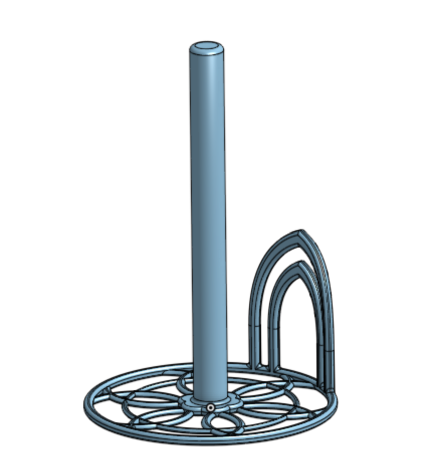 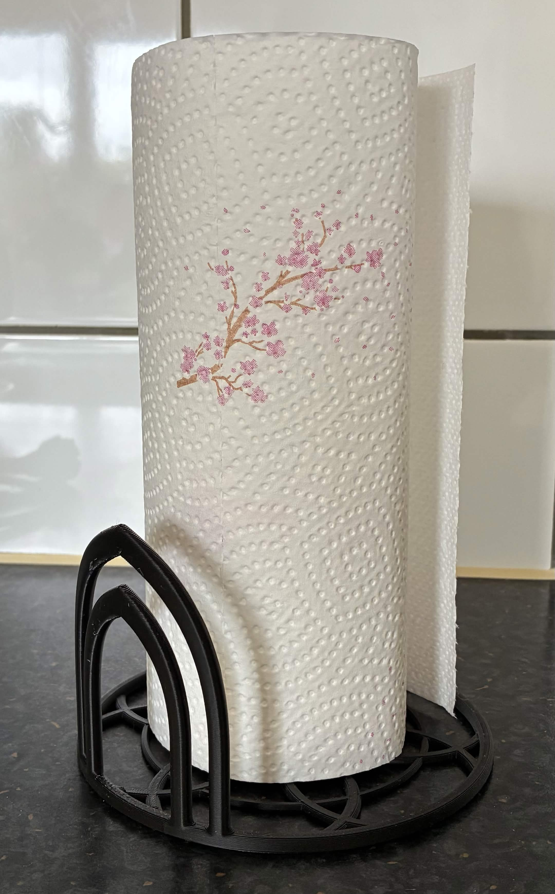

## Preparation for creating a model

To start, I drew inspiration from examples listed on a website. There, I came across this [paper towel holder](https://www.printables.com/model/527747-geometrical-paper-towel-holder-v2-updated) which I liked a lot. The paper towel holder we have at home is rather old and already falling apart, so I thought a 3D-printed one could be a nice addition to our home. And if I can customize its design, it’s even better! I wanted to incorporate some patterns from the hat of a video game character I like into the holder's design (see image below). The patterns are mostly symmetrical six-petalled flowers. At most, I wanted to include only the middle part because the full design would be too time-consuming and difficult to recreate, given my current modeling skills.

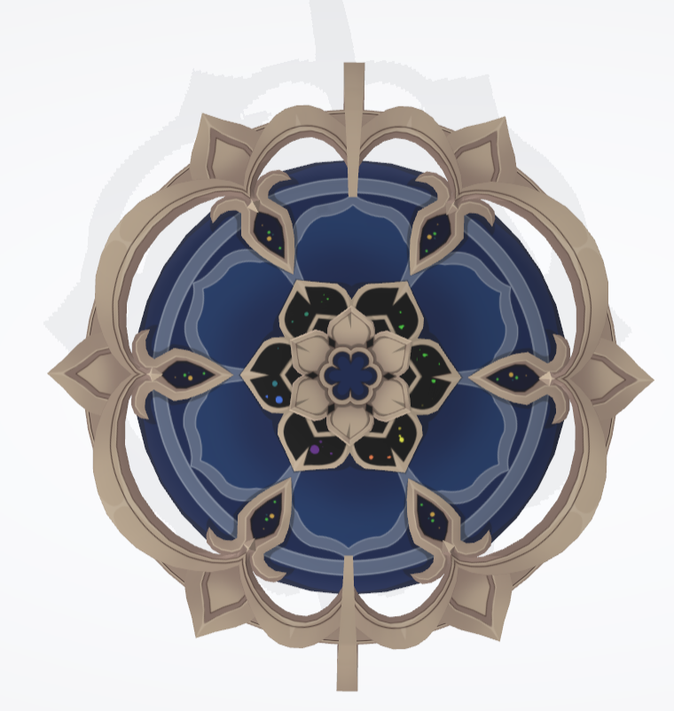

The only time I have fully 3D-modeled an object was during a course at the university 4 years ago. Back then, we used [Tinkercad](https://www.tinkercad.com), a very simple 3D modeling program that only let you combine primitive shapes to create new objects. In contrast, with [Onshape](https://www.onshape.com/en/), it is possible to create more detailed models and flexibly control the shapes and edges. However, that comes with a wider range of tools and a steeper learning curve.

Overall, the Onshape tutorials did a good job of introducing me to the available tools. Though sometimes it was difficult to follow the step-by-step tutorials from pictures and text descriptions alone. I struggled in particular with the funnel exercise (see image below). With an increasing number of parts, it was difficult to keep track of the constraints. So when I reached the step where I had to choose some specific parts to shell, my selection did not look like the one in the tutorial pictures. My sketch was probably not fully constrained like the one in the tutorial. Furthermore, it was difficult to determine exactly what was selected in the original picture. After working through all steps, my final object did not have the exact same volume and area as expected for the task, so I had to retrace some steps to get them right. At some point, I looked up video tutorials on YouTube to follow along more easily and do the steps correctly, because following along with images and text alone was difficult for me. Having a person explain the steps, seeing them select the tools from the menu, and showing the selected parts as the object is rotated in a video made it clearer to me what to do.

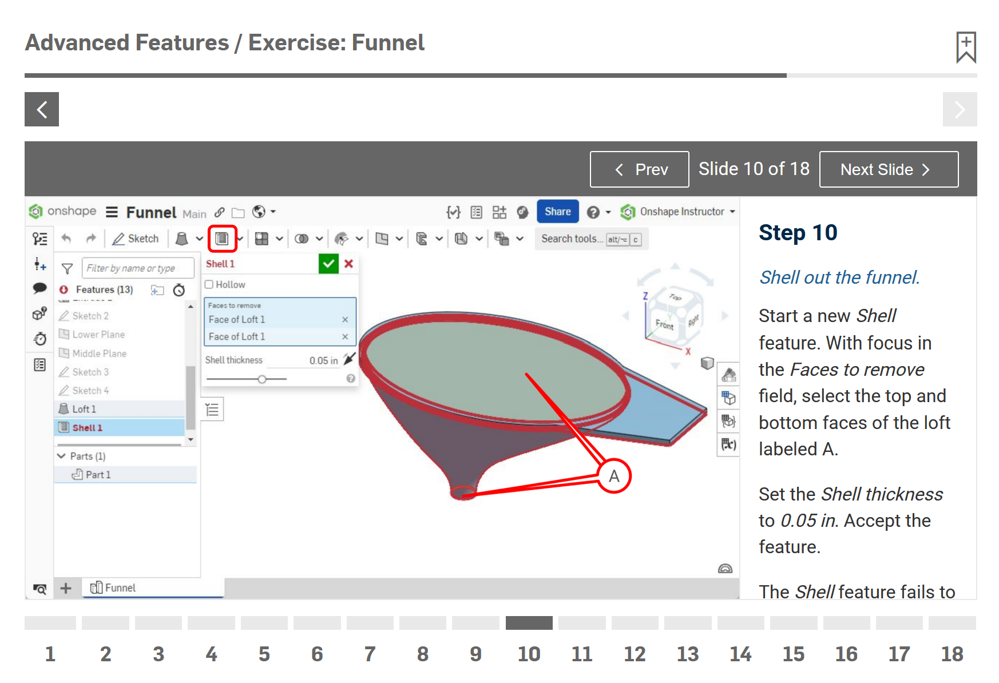

## Creating my own 3D model

My plan was to have the flower pattern be at the bottom of the paper towel holder. Since the maximum height of the object couldn’t exceed 25cm, I kept the pole in the middle at around 20cm. As a final touch, I wanted to have some decorative construction on the side with similar patterns.

The outer ring of the bottom part and the pole in the middle were created using the sketch and extrude commands, which were easy to do. I wanted the pole to be hollow on the inside to save some printing material. The first inner flower pattern, right at the bottom of the pole, was a bit more challenging to create, but I eventually managed to do it with the mirroring tool and by drawing construction lines dividing the circle into 6 equal parts that are 60 degrees apart (see image below).

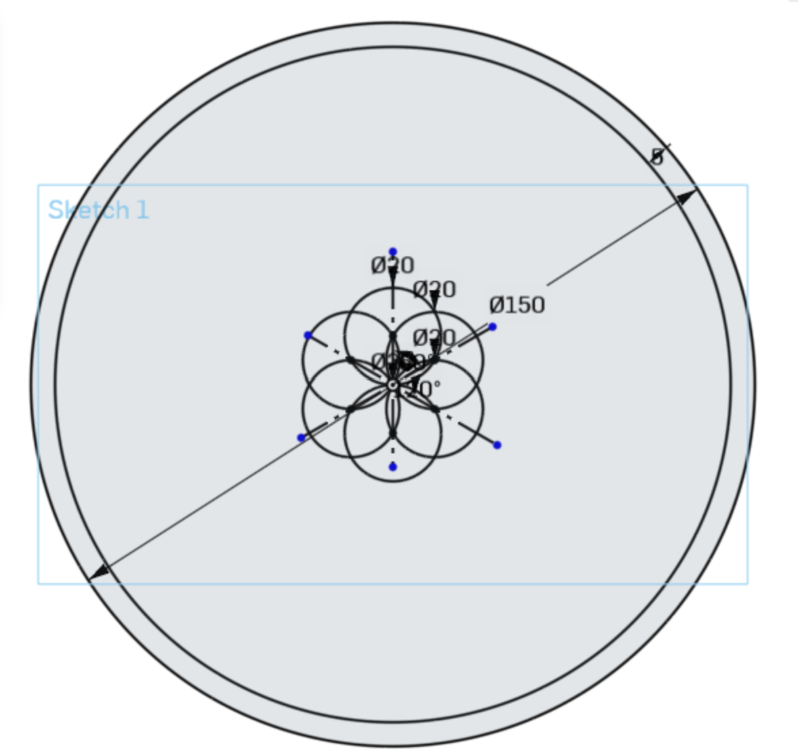

The most difficult part was the pattern at the bottom. At first, I tried using the spline tool to recreate one petal that I could mirror along my construction lines. However, during sketching, no matter how many constraints I added, the sketch still remained undefined (see image below). I eventually gave up on that approach and decided to simplify the pattern by sketching the petals using overlapping circles. I originally thought of sketching the paths and then using the sweep tool to create the flower pattern's lines, but after testing some settings, it didn’t work. So I simply created some offsets of the circles and used the extrude tool instead (see image below).

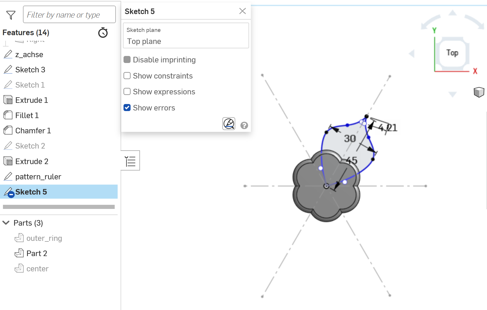 vs. 
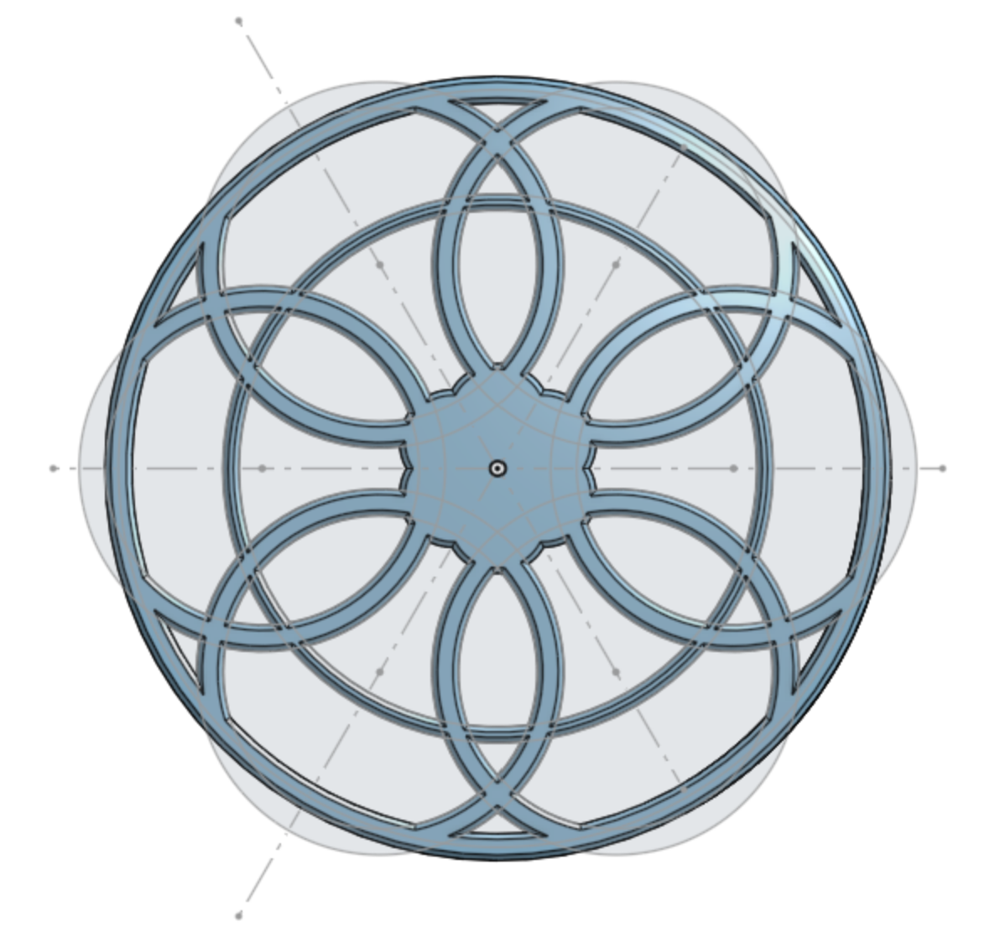 

As for the construction on the holder's side, I tried to create some patterns on the right-side plane and somehow combine them with an extruded part from the bottom, but that didn’t work. So I changed my strategy by using a sketch of the bottom part, extruding parts in different sizes, applying fillets to control the arc shapes, and then subtracting them with the boolean tool to create the arcs (see images below).

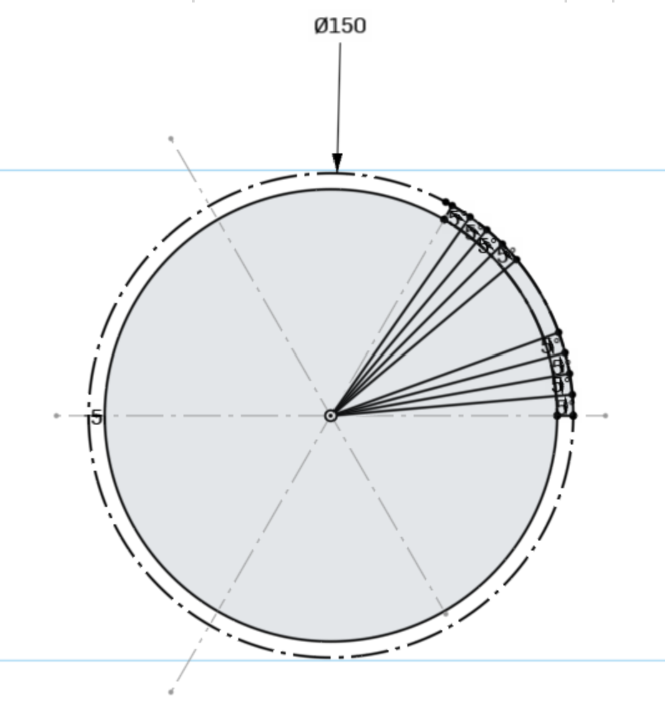 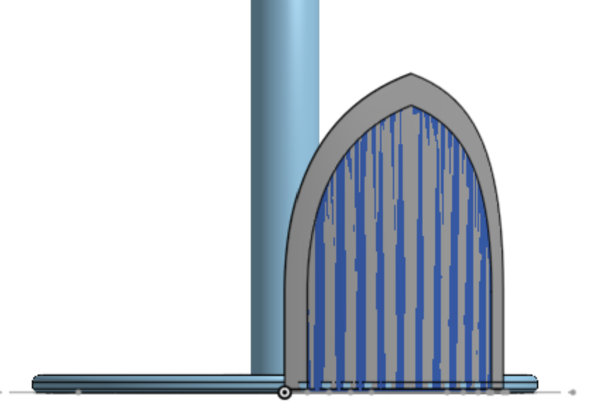

Lastly, I closed off the pole at the top with another extruded part and used the fillet and chamfer tool to round up the edges of the whole construct. I kept most of the widths below 1cm for the patterns so I’m concerned that the bottom part might be a bit fragile once the model is printed and might break easily. So I added one circle in the middle of the pattern as a stabilizer.

## Slicer settings

After I finished modeling the holder and imported it into QIDI I tested some settings and checked the printing preview. Across all settings, I chose the 0.28mm Extra Draft printing profile because it takes less time, and the “printing line” is thicker and more visible.

When the model was oriented as I modeled it and printed without any supports, it would have taken 2 hours and 48 minutes to print and would have used 57.33g of filament (see image below). So, at a baseline, my model was going to take up at least a few hours to print. I assume it’s because the printer has to switch between the bottom part, the pole, and the side construct all the time, so these switching times add up to the overall printing time.

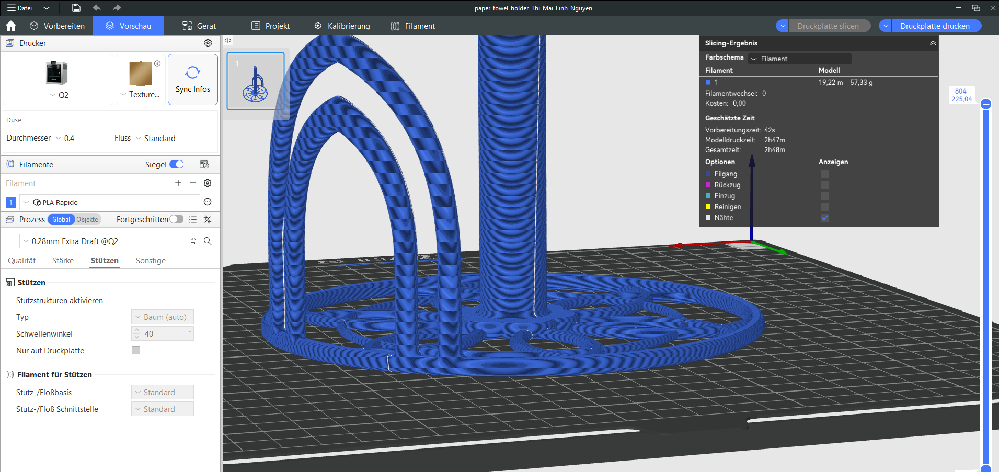

As seen in the image below, I tried different orientations of my model. However, it always led to a higher usage of filament (103g), required a lot of supports, and took much more time (5 hours). So in the end, I used the original orientation.

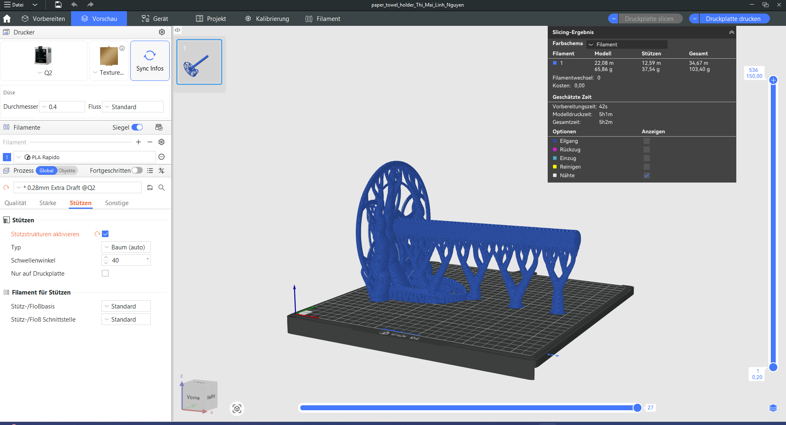

I was worried about the side arcs falling down, so I applied supports. At first, I chose the tree supports which looked alright for the arcs, but in the preview, the tree looked weird within the pole. Because the top of the pole is closed horizontally, a support structure forms below it within the hollow pole, but the tree was not printed from the base. Instead, it would appear in midair for some reason (see images below). I didn’t want to risk breaking the printed pole, so I tried the normal support construction instead. The tree support would have used the least amount of filament (4.49g) and only added roughly 2 minutes to the total printing time.

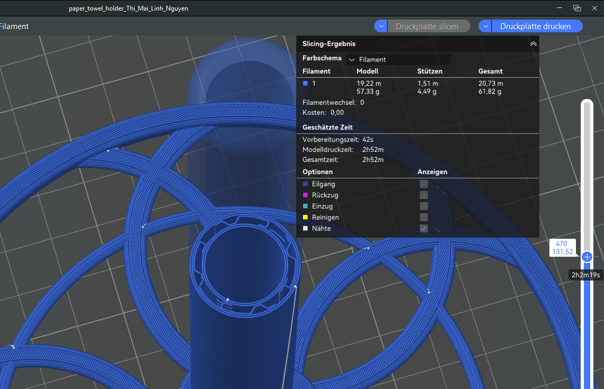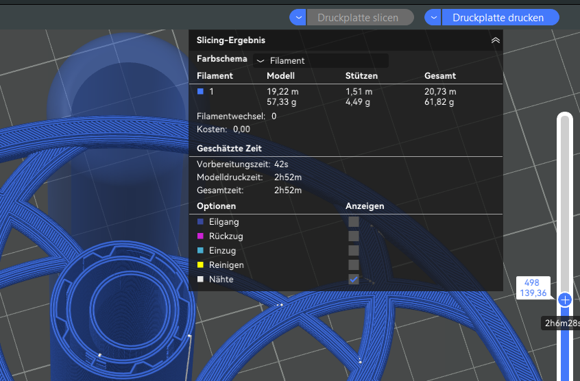

In comparison, the normal supports use more than double the amount of extra filament (11.33g) and add around 4 minutes to the printing time. As a trade-off, the support construction is printed starting from the base right away to support the pole's top closing (see image below).

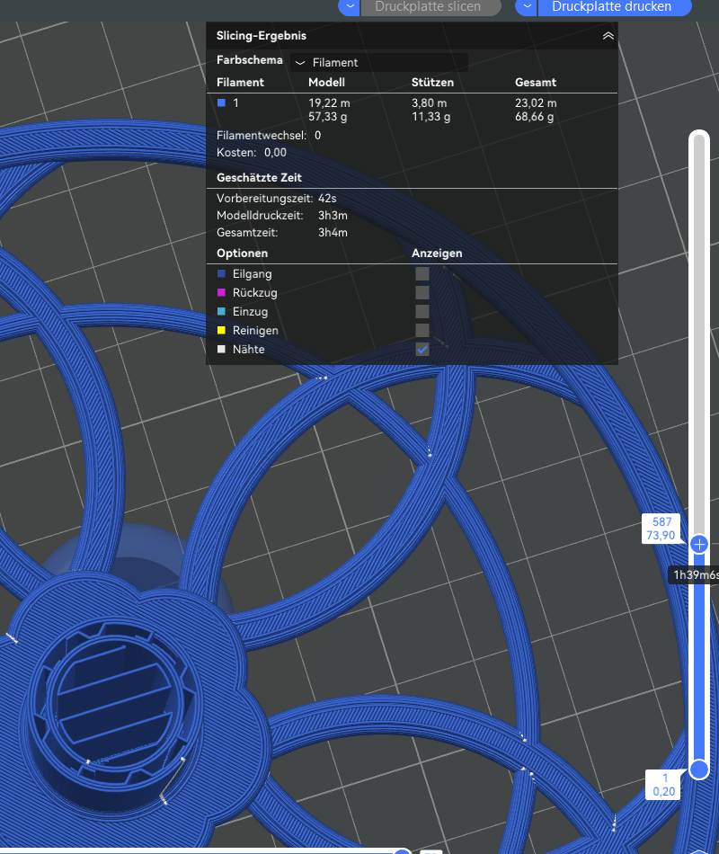

I was contemplating activating the brims for bed adhesion because the pole is rather tall and might tip to the side, but I hope the overall bottom area provides enough surface contact. If the printed model ends up tangled and tips over, I’d know why.

## 3D printed result

On 2nd July, we got our printed results. I’m glad my model didn't turn into a spaghetti mess! So the surface at the bottom was enough for it not to tip over. The supports for the arcs (see images below) need to be removed, and while I was doing that, I wondered whether I actually needed them. It worked in the end, and I’m happy with the result, so maybe the supports did help?

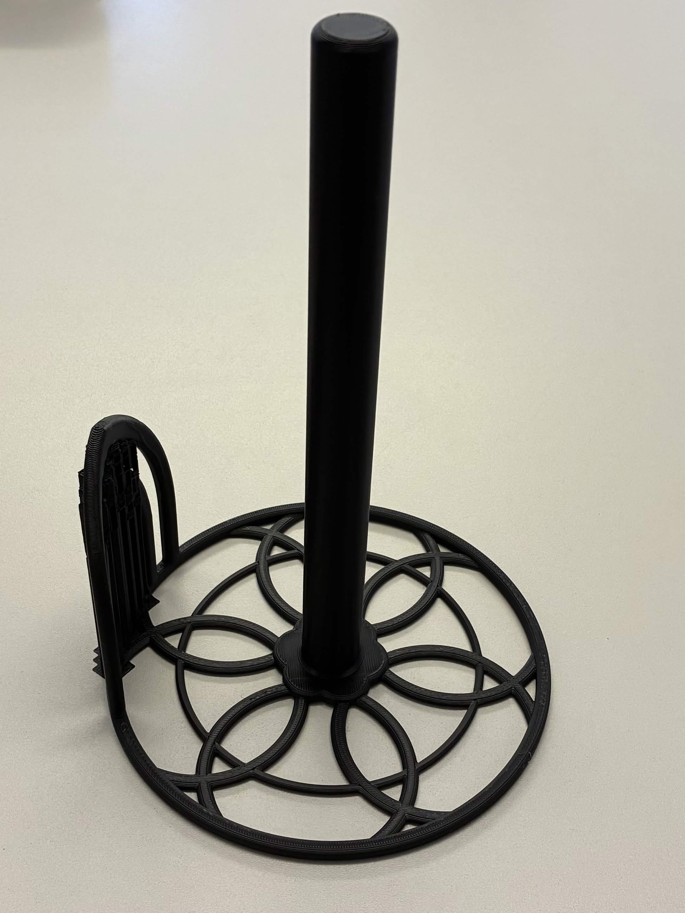 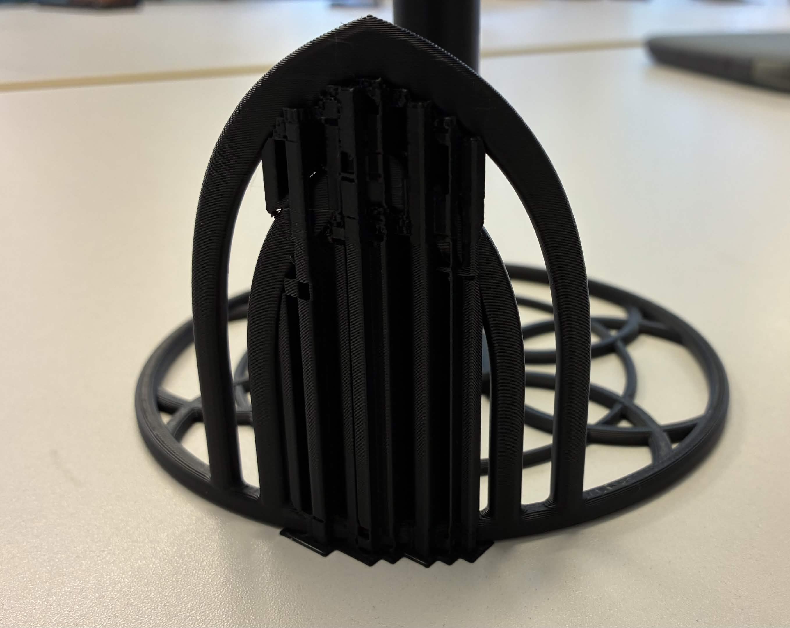

After I removed the supports with a plier, the holder was immediately put to use at home. While I was inserting the kitchen paper roll, I noticed that the middle pole was a bit too short (see images below). 3 to 4 additional centimeters would have been perfect for the pole to stick out of the hole so the holder could be grabbed and moved more easily, but overall I like the result!

 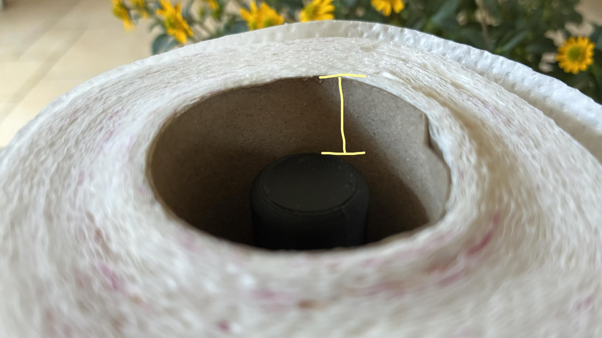

